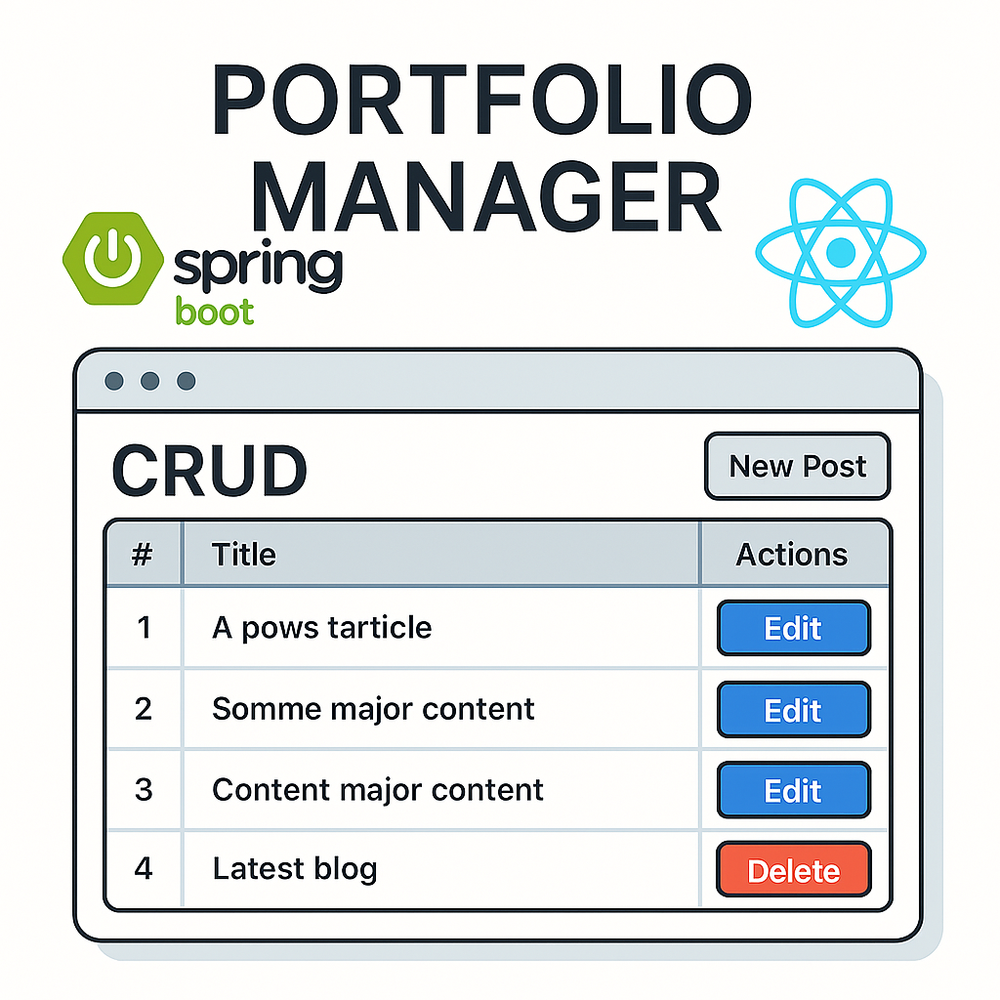

# 프로젝트 포트폴리오 관리 시스템 (개발 진행중)


## 📋 프로젝트 개요

이 프로젝트는 개인 포트폴리오 프로젝트를 관리하고 시각화하는 웹 애플리케이션입니다. 
Spring Boot 백엔드와 Next.js 를 사용한 프론트엔드로 구성되어 있으며, 
다양한 3D 갤러리 및 인터랙티브 UI로 포트폴리오를 효과적으로 전시할 수 있습니다.

이 프로젝트는 SpringBoot 와 NextJS를 연결하여 진행되는 프로젝트의 Boiler Plate를 연습하기 위한 프로젝트 입니다.

## 🔧 기술 스택

### Backend
- **Spring Boot 3.x**
- **Spring Data JPA**
- **MySQL
- **Java 21**

### Frontend
- **Next.js 15 (App Router)**
- **React 18**
- **TypeScript**
- **Three.js (React Three Fiber)**
- **Vanilla CSS**

## 🎯 주요 기능

### 1. 프로젝트 관리 (CRUD)
- 프로젝트 생성, 조회, 수정, 삭제
- 제목, 설명, 개발 기간, 기술 스택, URL, 썸네일 등 관리
- 이미지 업로드 및 관리

### 2. 다양한 갤러리 뷰
- **카드형 목록 뷰**: 전통적인 카드 레이아웃
- **3D 갤러리**: Three.js 기반 3D 입체 카드 갤러리
- **커버플로우**: 마우스 움직임에 따라 부드럽게 이동하는 3D 커버플로우 갤러리

### 3. 인터랙티브 UI
- 마우스 호버 효과
- 부드러운 애니메이션 및 전환
- 반응형 디자인
- 커서 인터랙션

## 🏗️ 프로젝트 구조

```
Project/
├── Backend/                    # Spring Boot 백엔드
│   ├── src/main/java/
│   │   └── com/example/portfolio/
│   │       ├── controller/
│   │       ├── entity/
│   │       ├── repository/
│   │       └── service/
│   └── build.gradle
└── Frontend/                   # Next.js 프론트엔드
    ├── app/                    # Next.js App Router
    │   ├── projects/
    │   │   ├── page.tsx        # 프로젝트 목록
    │   │   ├── new/page.tsx    # 프로젝트 생성
    │   │   ├── gallery/page.tsx # 3D 갤러리
    │   │   └── coverflow/page.tsx # 커버플로우 갤러리
    │   └── layout.tsx
    ├── src/
    │   ├── components/         # React 컴포넌트
    │   │   ├── ProjectList.tsx
    │   │   ├── ProjectForm.tsx
    │   │   ├── Project3DGallery.tsx
    │   │   └── CoverflowGallery.tsx
    │   ├── interfaces/         # TypeScript 인터페이스
    │   │   └── Project.ts
    │   └── services/           # API 서비스
    │       └── api.ts
    ├── public/
    │   └── images/             # 정적 이미지 파일
    └── package.json
```

## 🚀 설치 및 실행

### Prerequisites
- Node.js 18+
- Java 21
- Git

### Backend 실행
```bash
cd Backend
./gradlew bootRun
```
- 서버가 `http://localhost:8080`에서 실행됩니다.

### Frontend 실행
```bash
cd Frontend
npm install    # 또는 yarn install
npm run dev    # 또는 yarn dev
```
- 프론트엔드가 `http://localhost:3000`에서 실행됩니다.

## 📁 데이터베이스 스키마

```sql
CREATE TABLE Projects (
    id BIGINT AUTO_INCREMENT PRIMARY KEY,
    title VARCHAR(255) NOT NULL,
    description TEXT,
    period VARCHAR(100),
    techStack VARCHAR(500),
    projectUrl VARCHAR(500),
    githubUrl VARCHAR(500),
    thumbnailUrl VARCHAR(500),
    createdAt TIMESTAMP DEFAULT CURRENT_TIMESTAMP,
    updatedAt TIMESTAMP DEFAULT CURRENT_TIMESTAMP ON UPDATE CURRENT_TIMESTAMP
);
```

## 🎨 주요 컴포넌트

### 1. ProjectList 컴포넌트
- 프로젝트 목록을 카드형으로 표시
- 호버 효과 및 애니메이션 적용
- 기술 스택 태그 표시

### 2. Project3DGallery 컴포넌트
- Three.js 기반 3D 갤러리
- 마우스 드래그로 회전/확대 가능
- 클릭 시 프로젝트 상세 페이지로 이동

### 3. CoverflowGallery 컴포넌트
- 마우스 움직임에 따라 부드럽게 이동하는 3D 커버플로우
- 실시간 애니메이션 보간
- 카드 크기 및 간격 조정 가능

## 🎯 API 엔드포인트

### Backend API
```
GET    /api/projects          # 모든 프로젝트 조회
GET    /api/projects/{id}     # 특정 프로젝트 조회
POST   /api/projects          # 새 프로젝트 생성
PUT    /api/projects/{id}     # 프로젝트 수정
DELETE /api/projects/{id}     # 프로젝트 삭제
```

### Frontend 라우트
```
/projects                     # 프로젝트 목록 (카드형)
/projects/new                 # 새 프로젝트 추가
/projects/gallery             # 3D 갤러리 뷰
/projects/coverflow           # 커버플로우 갤러리 뷰
/projects/[id]               # 프로젝트 상세 페이지
```

## 🔧 주요 개발 이슈 및 해결

### 1. CORS 문제
- **문제**: 외부 이미지 URL 사용 시 CORS 정책 위반
- **해결**: `public/images` 폴더에 이미지 직접 저장 후 `/images/파일명` 경로 사용

### 2. SSR에서 document is not defined 에러
- **문제**: Three.js TextureLoader가 SSR 환경에서 document 객체 참조
- **해결**: `useLoader` 훅 사용 및 컴포넌트 분리

### 3. 커버플로우 애니메이션 최적화
- **문제**: 마우스 움직임 시 카드가 끊기듯 이동
- **해결**: 상태 보간(interpolation) 및 `requestAnimationFrame` 적용

## 📱 페이지별 기능

### 프로젝트 목록 페이지 (`/projects`)
- 카드형 레이아웃으로 프로젝트 목록 표시
- 호버 효과 및 애니메이션
- 3D 갤러리, 커버플로우 갤러리로 이동 버튼

### 3D 갤러리 페이지 (`/projects/gallery`)
- Three.js 기반 3D 입체 카드 갤러리
- 마우스 드래그로 회전/확대 가능
- OrbitControls로 자유로운 시점 조작

### 커버플로우 갤러리 페이지 (`/projects/coverflow`)
- 마우스 움직임에 따라 부드럽게 이동하는 3D 커버플로우
- 실시간 애니메이션 보간
- 큰 카드 크기로 시각적 임팩트 극대화

### 프로젝트 추가 페이지 (`/projects/new`)
- 프로젝트 정보 입력 폼
- 썸네일 이미지 URL 입력 (public/images 경로 사용)
- 유효성 검사 및 에러 처리

## 🎨 스타일링

### CSS 설계 원칙
- 부트스트랩 없이 순수 CSS로 구현
- 모던하고 인터랙티브한 디자인
- 반응형 레이아웃 지원
- 호버 효과 및 애니메이션 적용

### 주요 스타일 특징
- 카드형 레이아웃 (Grid/Flexbox)
- 부드러운 호버 애니메이션
- 입체적인 그림자 효과
- 기술 스택 태그 디자인

## 🚀 향후 개발 계획

- 추가 예정
